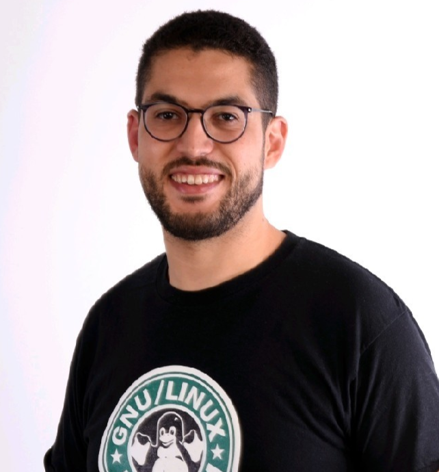

# WHO-AM-I 

{: style="width:100px;border-radius: 50%;"}

Welcome to my personal blog, and thank you for visiting!

Greeting ...

My name is Seddik, I am system information graduated from Ingesup, currently based in Montigny les Cormeilles city France. I am an avid supporter of Open Source software and GNU Project.

## Employment History

- **Group SII** : Linux System Engineer
- **Numberly (1000mercis Group)** : Apprentice Linux SysAdmin
- **Net-Veille Systems** : Apprentice Linux Admin
- **LeCab** : Apprentice System Administrator
- **Capgemini** : IT Production
- **INTELCIA** : Network Support Specialist
- **NSE** : Network Administrator
- **Colas** : Apprentice IT Support

## Open Source community contribution 

### Fedora Infra

I joined Fedora Infrastructure in july 2020, I am currently working on the monitoring and automation stuff.

## Contact me
- Email : seddik AT fedoraproject DOT org
- IRC [libera.chat](https://libera.chat/) : saibug
- Matrix [fedora.im] : saibug #fedora-admin #fedora-noc
- Slack [grafana] : saibug